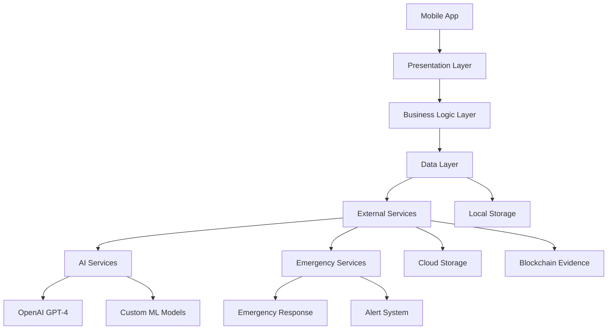

# Cyber Crime Support App - Software Architecture

## 1. System Overview



## 2. Architecture Layers

### 2.1 Presentation Layer (UI)
```dart
lib/
├── presentation/
│   ├── screens/
│   │   ├── home_screen.dart
│   │   ├── chat_screen.dart
│   │   ├── emergency_screen.dart
│   │   ├── evidence_collection_screen.dart
│   │   ├── case_tracking_screen.dart
│   │   ├── forensics_screen.dart
│   │   ├── blockchain_verification_screen.dart
│   │   └── resources_screen.dart
│   ├── widgets/
│   │   ├── emergency_button.dart
│   │   ├── chat_bubble.dart
│   │   ├── evidence_card.dart
│   │   ├── case_status_widget.dart
│   │   ├── blockchain_verify_widget.dart
│   │   ├── ml_analysis_widget.dart
│   │   └── resource_card.dart
│   └── themes/
│       ├── app_theme.dart
│       ├── dark_theme.dart
│       └── custom_theme.dart
```

### 2.2 Business Logic Layer
```dart
lib/
├── bloc/
│   ├── chat/
│   │   ├── chat_bloc.dart
│   │   ├── chat_event.dart
│   │   └── chat_state.dart
│   ├── emergency/
│   │   ├── emergency_bloc.dart
│   │   ├── emergency_event.dart
│   │   └── emergency_state.dart
│   ├── evidence/
│   │   ├── evidence_bloc.dart
│   │   ├── evidence_event.dart
│   │   └── evidence_state.dart
│   ├── blockchain/
│   │   ├── blockchain_bloc.dart
│   │   ├── blockchain_event.dart
│   │   └── blockchain_state.dart
│   └── case/
│       ├── case_bloc.dart
│       ├── case_event.dart
│       └── case_state.dart
```

### 2.3 Domain Layer
```dart
lib/
├── domain/
│   ├── entities/
│   │   ├── message.dart
│   │   ├── evidence.dart
│   │   ├── case.dart
│   │   ├── blockchain_record.dart
│   │   ├── forensic_report.dart
│   │   ├── resource.dart
│   │   └── user.dart
│   ├── repositories/
│   │   ├── chat_repository.dart
│   │   ├── emergency_repository.dart
│   │   ├── evidence_repository.dart
│   │   ├── blockchain_repository.dart
│   │   └── case_repository.dart
│   └── usecases/
│       ├── send_message.dart
│       ├── collect_evidence.dart
│       ├── verify_blockchain.dart
│       ├── generate_forensic_report.dart
│       ├── track_case.dart
│       └── trigger_emergency.dart
```

### 2.4 Data Layer
```dart
lib/
├── data/
│   ├── repositories/
│   │   ├── chat_repository_impl.dart
│   │   ├── emergency_repository_impl.dart
│   │   ├── evidence_repository_impl.dart
│   │   ├── blockchain_repository_impl.dart
│   │   └── case_repository_impl.dart
│   ├── datasources/
│   │   ├── local/
│   │   │   ├── secure_storage.dart
│   │   │   ├── evidence_storage.dart
│   │   │   ├── blockchain_storage.dart
│   │   │   └── encrypted_prefs.dart
│   │   └── remote/
│   │       ├── api_service.dart
│   │       ├── gpt4_service.dart
│   │       ├── blockchain_service.dart
│   │       ├── ml_analysis_service.dart
│   │       └── cloud_storage_service.dart
│   └── models/
│       ├── message_model.dart
│       ├── evidence_model.dart
│       ├── blockchain_model.dart
│       ├── case_model.dart
│       └── user_model.dart
```

## 3. Core Components

### 3.1 AI Services Integration
```dart
class AIService {
  final OpenAI _gpt4;
  final EvidenceAnalyzer _evidenceAnalyzer;
  final MLModel _customModel;
  
  Future<ChatResponse> processChatMessage(String message);
  Future<EvidenceAnalysis> analyzeEvidence(Evidence evidence);
  Future<ThreatAssessment> assessThreat(CaseDetails details);
  Future<ForensicReport> generateForensicReport(Evidence evidence);
}
```

### 3.2 Blockchain Integration
```dart
class BlockchainService {
  final Web3Client _web3Client;
  final SmartContract _evidenceContract;
  
  Future<String> storeEvidence(Evidence evidence);
  Future<bool> verifyEvidence(String hash);
  Future<BlockchainRecord> getEvidenceRecord(String id);
}
```

### 3.3 Evidence Collection
```dart
class EvidenceManager {
  final SecureStorage _storage;
  final Encryption _encryption;
  final MetadataCollector _metadata;
  final BlockchainService _blockchain;
  
  Future<void> collectEvidence(Evidence evidence);
  Future<void> secureEvidence(Evidence evidence);
  Future<String> storeOnBlockchain(Evidence evidence);
  Future<Evidence> retrieveEvidence(String id);
}
```

## 4. Security Architecture

### 4.1 Data Protection
```dart
class SecurityManager {
  final Encryption _encryption;
  final BiometricAuth _biometricAuth;
  final TokenManager _tokenManager;
  final BlockchainVerifier _blockchainVerifier;
  
  Future<void> secureData(SensitiveData data);
  Future<void> verifyUser(BiometricPrompt prompt);
  Future<String> generateSecureToken();
  Future<bool> verifyBlockchainRecord(String hash);
}
```

## 5. Dependencies

```yaml
dependencies:
  flutter:
    sdk: flutter
  flutter_bloc: ^8.1.3
  get_it: ^7.6.0
  dio: ^5.3.2
  web3dart: ^2.7.1
  encrypted_shared_preferences: ^3.0.1
  flutter_secure_storage: ^8.0.0
  local_auth: ^2.1.6
  firebase_core: ^2.15.1
  firebase_auth: ^4.9.0
  cloud_firestore: ^4.9.1
  firebase_storage: ^11.2.6
  geolocator: ^10.0.0
  image_picker: ^1.0.4
  path_provider: ^2.1.1
  permission_handler: ^10.4.3
  flutter_local_notifications: ^15.1.1
  openai: ^1.0.0
  ml_kit: ^0.7.3
  blockchain: ^5.0.0
```

## 6. Testing Strategy

```dart
test/
├── unit/
│   ├── services/
│   │   ├── ai_service_test.dart
│   │   ├── blockchain_service_test.dart
│   │   ├── evidence_manager_test.dart
│   │   └── security_manager_test.dart
├── integration/
│   ├── blockchain_integration_test.dart
│   ├── evidence_collection_flow_test.dart
│   ├── case_reporting_flow_test.dart
│   └── emergency_response_flow_test.dart
└── e2e/
    ├── full_case_reporting_test.dart
    ├── blockchain_verification_test.dart
    └── evidence_submission_test.dart
```

## 7. Error Handling & Logging

```dart
class ErrorManager {
  final CrashlyticService _crashlytics;
  final LoggingService _logging;
  final BlockchainLogger _blockchainLogger;
  final UserNotifier _notifier;
  
  Future<void> handleError(AppError error);
  Future<void> logSecurityEvent(SecurityEvent event);
  Future<void> logBlockchainTransaction(Transaction tx);
  Future<void> notifyUser(UserNotification notification);
}
```

## 8. Performance Optimization

- Lazy loading of heavy resources
- Image compression for evidence
- Background processing for encryption
- Blockchain operations in background
- Smart caching strategies
- Efficient state management with BLoC pattern
- Optimized ML model inference

## 9. Deployment Configuration

```yaml
flutter:
  assets:
    - assets/images/
    - assets/icons/
    - assets/translations/
    - assets/ml_models/
  environment:
    sdk: ">=3.0.0 <4.0.0"
  
flavors:
  development:
    app_id: com.cybercrime.app.dev
    firebase: dev_config.json
    blockchain: testnet_config.json
  staging:
    app_id: com.cybercrime.app.staging
    firebase: staging_config.json
    blockchain: testnet_config.json
  production:
    app_id: com.cybercrime.app
    firebase: prod_config.json
    blockchain: mainnet_config.json
```

## 10. Monitoring & Analytics

### 10.1 Performance Monitoring
- Firebase Performance Monitoring
- Custom trace events
- Network request tracking
- UI rendering performance
- Blockchain transaction monitoring
- ML model performance metrics

### 10.2 Usage Analytics
- User engagement metrics
- Feature usage tracking
- Error rate monitoring
- User journey analysis
- Blockchain interaction metrics
- AI response effectiveness

## 11. Compliance & Standards

- GDPR compliance
- CCPA compliance
- ISO 27001 standards
- OWASP security guidelines
- Blockchain data standards
- ML model fairness guidelines
- Data protection regulations

---
*For implementation details and contribution guidelines, refer to our [Development Guide](./technical/dev_guide.md)* 